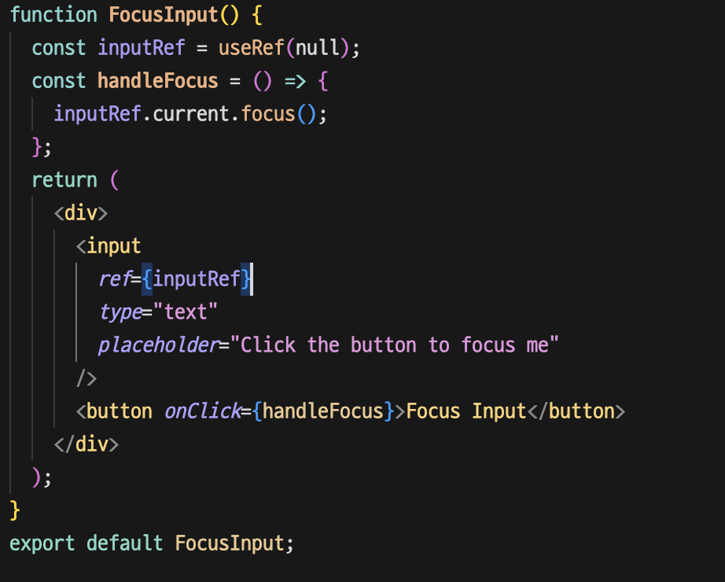
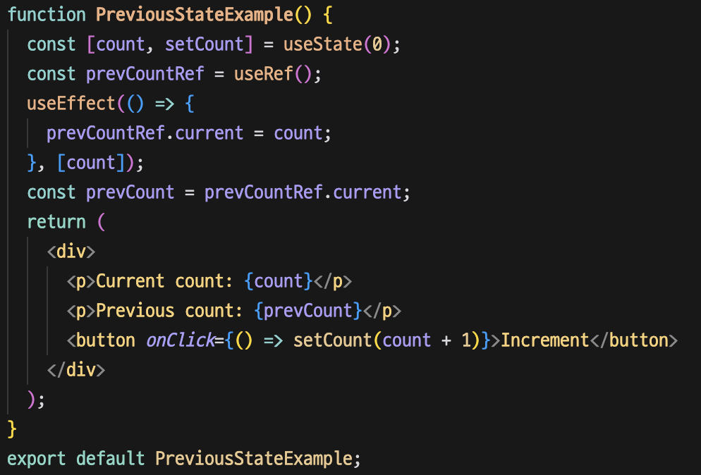

React의 `useRef` 훅은 DOM 요소를 직접 조작하고 렌더링 전반에 걸쳐 값을 지속시키는 데 사용할 수 있는 강력한 도구입니다. 이 글에서는 기본 사용법부터 고급 시나리오까지 `useRef`를 예제와 함께 자세히 살펴보겠습니다.

1. **useRef가 무엇인가요?**

useRef`는 리렌더링을 시키지 않고 렌더링 전반에 걸쳐 지속되는 변경 가능한 값을 저장하거나 DOM 요소에 액세스하고 상호 작용하는 방법을 제공하는 훅입니다.

1. **왜 useRef가 중요한가요?**

- 필요없는 리렌더링을 줄이기 위해

state 변수를 `useState`를 사용해 업데이트하면 React는 UI의 변경 사항을 반영하기 위해 컴포넌트를 다시 렌더링합니다. 이는 일반적으로 상태 변경이 렌더링의 출력에 영향을 미칠 때 원하는 방식입니다. 그러나 값을 저장하거나 DOM 요소와 상호 작용해야 하지만 컴포넌트가 다시 렌더링되는 것을 원하지 않는 상황이 있습니다. 이때 `useRef`가 유용합니다.

useRef`는 값이 변경될 때 다시 렌더링을 트리거하지 않으므로 다음과 같은 경우에 적합합니다:

- 컴포넌트의 렌더링에 영향을 주지 않는 변경 가능한 값을 저장할 때
- DOM요소에 직접 접근할 때
- 이전 값을 추적할 때

- 렌더링이 돼도 값을 유지하기 위해

useRef`에 저장된 값은 렌더링 간에 지속됩니다. 즉, 컴포넌트가 다시 렌더링되더라도 `useRef`객체의`current` 프로퍼티는 해당 값을 유지합니다. 이는 타이머, 이전 상태 값 또는 재렌더링 시 재설정되지 않아야 하는 기타 변경 가능한 데이터와 같은 값을 유지하는 데 특히 유용합니다.

- 직접 DOM 조작

React에서 DOM을 직접 조작하는 경우는 흔하지 않습니다. 하지만 입력 필드에 포커스를 맞추거나 엘리먼트의 크기를 측정하는 등 이를 수행해야 하는 경우가 있습니다. useRef`는 DOM 요소를 직접 참조하는 방법을 제공합니다.

예시1. 직접적인 dom 접근

아래 예시는 dom에 직접 접근해 focus요소를 사용하는 예시입니다. button을 누르면 input태그에 focus요소가 활성화됩니다.

예시2. 렌더링이 진행되어도 값 저장하기

아래코드는 count라는 값이 변경될 때마다 prevCount를 저장하는 코드입니다.

리렌더링이 되어도 prevCountRef는 변경되지 않고 prevCount에 값이 저장되며 useEffect를 통해 최신화가 이루어집니다. 결론적으론 prevCount와 count의 값이 다릅니다.

**결론**

useRef 훅은 React의 다용도 도구로 다음과 같은 작업을 수행할 수 있습니다

- DOM 요소에 직접 액세스하고 조작할 수 있습니다.
- 리렌더링을 시키지 않고 렌더링 전반에 걸쳐 지속되는 변경 가능한 값을 저장합니다.
- React 애플리케이션의 효율성과 성능을 유지하세요.
