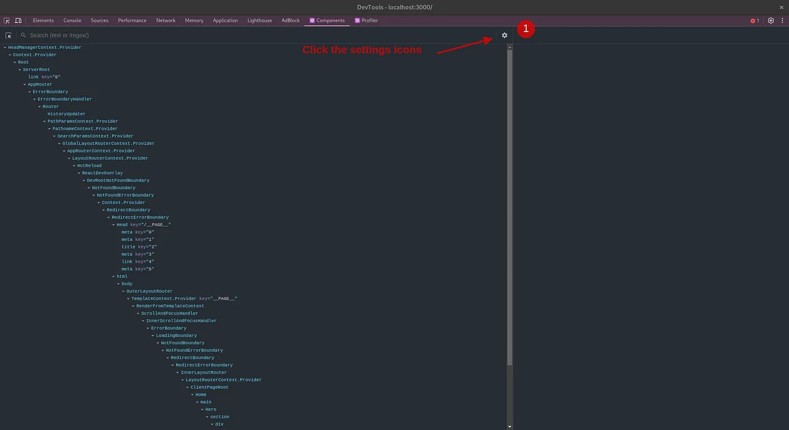
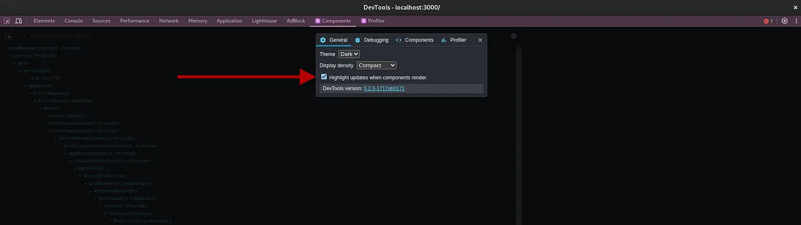
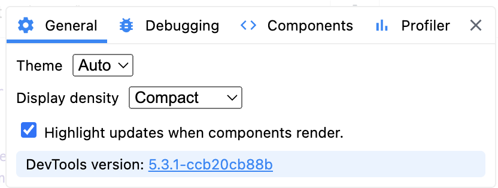

react 개발자에게 가장 중요한 작업은 react 애플리케이션에서 어떤 컴포넌트가 반복해서 렌더링되는지 찾는 것입니다. 이를 통해 메모리 누수 및 웹사이트 성능 문제를 방지할 수 있습니다.

- **react 에서 어떤 컴포넌트가 다시 렌더링되는지 확인하는 방법!**

크롬을 사용하고 있다면 [React dev tool](https://chromewebstore.google.com/detail/react-developer-tools/fmkadmapgofadopljbjfkapdkoienihi)를 설치해주세요.

React dev tool을 설치한 후 개발자 도구를 열고 **component** 탭으로 이동하여 **settings** 아이콘을 클릭합니다.

그런 다음 개발 도구의 일반 설정 탭에서 Highlight updates when components render를 활성화해야 합니다.

이제 react 웹사이트에서 어떤 컴포넌트가 리렌더링되는지 알려주는 테두리를 볼 수 있습니다.

위 효과는 개발자도구(f12)를 열지 않으면 발생하지 않습니다.

**결론**

위 효과를 이용해 원치않은 컴포넌트 렌더링을 방지할 수 있겠네요!
