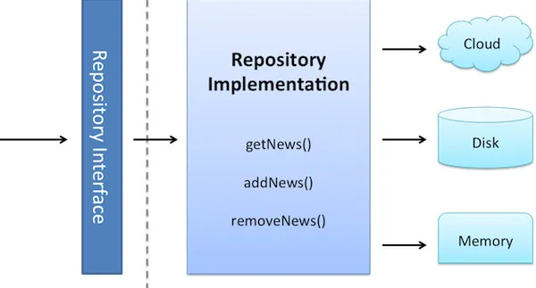
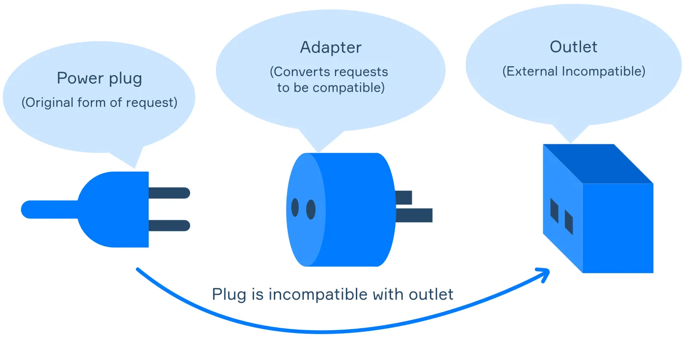

이 글에서는 함수형 컴포넌트와 후크를 사용해 React 애플리케이션에서 이러한 디자인 패턴을 구현하는 방법을 살펴보겠습니다. 끝날 때쯤이면 React 코드베이스를 깔끔하고 유지 관리하기 쉬운 상태로 유지하는 방법을 더 잘 이해하게 될 것입니다.

최신 소프트웨어 개발에서는 깔끔하고 모듈화되어 있으며 테스트 가능한 코드를 유지하는 것이 매우 중요합니다. 사용자 인터페이스를 구축하는 데 널리 사용되는 JavaScript 라이브러리인 React는 컴포넌트 기반 아키텍처를 권장합니다. 하지만 애플리케이션이 성장함에 따라 데이터 및 API 상호 작용을 관리하는 것이 복잡해질 수 있습니다. 이때 리포지토리 및 어댑터 패턴과 같은 디자인 패턴이 유용합니다.

1. Repository Pattern

저장소 패턴은 데이터 계층을 추상화하여 도메인 개체에 액세스하기 위한 컬렉션과 같은 인터페이스를 제공합니다. 도메인과 데이터 매핑 레이어 사이를 중재하여 메모리 내 도메인 객체 컬렉션처럼 작동합니다.



1. Adapter Pattern

어댑터 패턴을 사용하면 호환되지 않는 인터페이스를 함께 작동할 수 있습니다. 이 패턴은 클래스의 인터페이스를 클라이언트가 기대하는 다른 인터페이스로 변환합니다. 이 패턴은 종종 기존 클래스가 소스 코드를 수정하지 않고 다른 클래스와 함께 작동하도록 하는 데 사용됩니다.



**폴더 구조**

```jsx
src/
├── adapters/
│   └── apiAdapter.js
├── components/
│   └── ItemsComponent.js
├── repositories/
│   └── dataRepository.js
├── services/
│   └── apiService.js
├── App.js
└── index.js
```

src/repositories/dataRepository.js

```jsx
const DataRepository = (apiAdapter) => ({
  getAllItems: async () => {
    return await apiAdapter.get("/items");
  },

  getItemById: async (id) => {
    return await apiAdapter.get(`/items/${id}`);
  },

  createItem: async (data) => {
    return await apiAdapter.post("/items", data);
  },

  updateItem: async (id, data) => {
    return await apiAdapter.put(`/items/${id}`, data);
  },

  deleteItem: async (id) => {
    return await apiAdapter.delete(`/items/${id}`);
  },
});

export default DataRepository;
```

src/adapters/apiAdapter.js

```jsx
import axios from "axios";

const ApiAdapter = (baseURL) => {
  const client = axios.create({
    baseURL: baseURL,
  });

  return {
    get: async (url) => {
      const response = await client.get(url);
      return response.data;
    },

    post: async (url, data) => {
      const response = await client.post(url, data);
      return response.data;
    },

    put: async (url, data) => {
      const response = await client.put(url, data);
      return response.data;
    },

    delete: async (url) => {
      const response = await client.delete(url);
      return response.data;
    },
  };
};

export default ApiAdapter;
```

**위 코드를 컴포넌트에서 사용해보자**

src/components/ItemsComponent.js

```jsx
import React, { useEffect, useState } from "react";
import DataRepository from "../repositories/dataRepository";
import ApiAdapter from "../adapters/apiAdapter";

const apiAdapter = ApiAdapter("https://api.example.com");
const dataRepository = DataRepository(apiAdapter);

const ItemsComponent = () => {
  const [items, setItems] = useState([]);

  useEffect(() => {
    const fetchItems = async () => {
      const data = await dataRepository.getAllItems();
      setItems(data);
    };
    fetchItems();
  }, []);

  return (
    <div>
      <h1>Items</h1>
      <ul>
        {items.map((item) => (
          <li key={item.id}>{item.name}</li>
        ))}
      </ul>
    </div>
  );
};

export default ItemsComponent;
```

**결론**

프론트엔드에서 정형화된 코드구조가 있습니다. 아이템 리스트를 가져오는 것, 아이템을 아이디로 가져오는 것, 아이템을 만드는 것, 업데이트 하는 것, 삭제하는 것 이런 정형화된 구조를 깔끔하게 만들어주는 디자인패턴이 아닌가 싶습니다.
